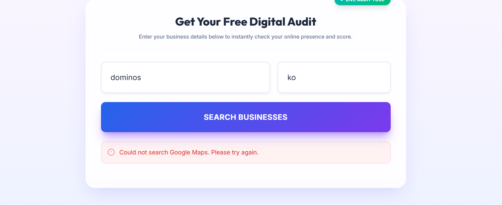

# BizList - AI-Powered Business Audit & Lead Generation Tool

> An intelligent, full-stack application that analyzes local businesses' digital footprint, calculates growth potential, and generates actionable leads for digital agencies.

 *(Note: Please add a banner image to `client/public/banner.png`)*

## 🚀 Overview

BizList is a powerful MERN stack application designed for digital marketing agencies. It automates the process of evaluating a local business's online presence. By simply entering a business name and location, BizList performs a comprehensive scrape of Google Maps and the business's website to generate a detailed "Digital Health Score". 

This score reveals critical gaps in their online strategy (missing hours, low review margins, poor website SEO) and instantly positions the agency as a data-driven solution provider.

### Core Features

- 🤖 **AI-Powered Analysis**: Utilizes Google Gemini to provide intelligent suggestions, categorize businesses, and explain score metrics.
- 🗺️ **Deep Google Maps Integration**: Scrapes real-time data including ratings, review counts, claim status, and owner response rates using automated browser instances (Puppeteer).
- 📊 **Dynamic Scoring Engine**: Calculates specialized scores across four vectors: `Search Readiness`, `Local Execution`, `Brand Authority`, and `Website Experience`.
- 💰 **Revenue Architecture**: Predicts "Missed Revenue" and calculates an agency-specific "Opportunity Score" based on local area pressures and competition.
- 📱 **Modern, Responsive UI**: Built with React, Vite, and Tailwind CSS, featuring smooth Framer Motion animations and dark-mode premium aesthetics.

---

## 🛠️ Technology Stack

### Frontend (Client)
- **Framework**: React 19 + Vite
- **Styling**: Tailwind CSS v4, Lucide React (Icons)
- **Animations**: Framer Motion
- **Routing**: React Router v7
- **Authentication**: Clerk (Prepared for future extension)

### Backend (Server)
- **Runtime**: Node.js + Express
- **Database**: MongoDB + Mongoose
- **Scraping**: Puppeteer (Headless Chrome), Cheerio
- **AI Integration**: Google Generative AI (Gemini)
- **Task Management**: P-Queue (concurrency control)
- **Security**: Helmet, Express Rate Limit, CORS

---

## 🗂️ Project Structure

This project is a Monorepo containing both the frontend and backend.

```
lead-gen-tool/
├── client/                     # Vite + React Frontend
│   ├── src/
│   │   ├── components/         # Reusable UI elements (ScoreCard, ResultsSection, etc.)
│   │   ├── pages/              # Route pages (HomePage, Dashboard, Onboarding, etc.)
│   │   └── services/           # API communication logic
|   ├── .env                    # Client environment variables
│   └── package.json    
|
├── server/                     # Node.js + Express Backend
│   ├── config/                 # Database configuration
│   ├── controllers/            # Route logic (audit, search, suggestions)
│   ├── intelligence/           # Advanced logic (Competitor Gaps, Visibility Radar)
│   ├── models/                 # Mongoose schema definitions
│   ├── prediction/             # Growth potential calculations
│   ├── scrapers/               # Fallback API scrapers
│   ├── utils/                  # Core logic: Puppeteer Scraper, Score Calculators
|   ├── .env                    # Server environment variables
│   └── server.js               # Entry point
|
└── package.json                # Root package manager (concurrent scripts)
```

---

## 💻 Local Development Setup

### 1. Prerequisites
- Node.js (v18 or higher recommended)
- MongoDB Database (Local or MongoDB Atlas)
- Google Gemini API Key
- Google Places API Key (Optional fallback)

### 2. Installation

Clone the repository and install dependencies from the root directory:

```bash
git clone https://github.com/Zeeshan3h3/BizList.git
cd BizList
npm run install-all
```

### 3. Environment Variables
You need to set up two environment files based on the provided `.env.example`.

**`server/.env`**:
```ini
PORT=3000
NODE_ENV=development
MONGODB_URI=mongodb://localhost:27017/bizcheck
GEMINI_API_KEY=your_gemini_key
GOOGLE_PLACES_API_KEY=your_places_key
DEBUG_SCRAPER=false
```

**`client/.env`**:
```ini
VITE_API_URL=http://localhost:3000
```

### 4. Running the App

You can start both the client and the server concurrently from the root directory:

```bash
npm run build 
npm start
```
*(Alternatively, run `npm run dev` in the client directory and `nodemon server.js` in the server directory in separate terminals).*

---

## ☁️ Deployment (Safe Mode)

The codebase is properly configured for production deployment using platforms like Vercel (Frontend) and Render/Railway (Backend). 

For detailed, step-by-step logic on deploying a Puppeteer application, maintaining a Monorepo on GitHub, and handling Web Socket timeouts, please refer to the `deployment_guide.md` (if available in your artifact history) or follow these general principles:

1. **Frontend**: Deploy the `client/` directory to Vercel. Ensure `VITE_API_URL` points to your live backend.
2. **Backend**: Deploy the `server/` directory to Render/Railway. 
    - **CRITICAL**: Because Puppeteer needs Chromium, you must configure your hosting provider to provide Chromium natively and set the `PUPPETEER_EXECUTABLE_PATH` environment variable (e.g., `/usr/bin/google-chrome`).

---

## 🔒 Security & Anti-Bot Architecture

- **Puppeteer Evasion**: Implements realistic User-Agents, random delays/jitters, and Request Interception (blocking heavy fonts/CSS) to prevent Google Maps bans while maximizing speed.
- **Queueing Engine**: Uses `p-queue` to handle concurrent audit requests globally, preventing server memory overflow.
- **Middleware Safety**: Secured with `helmet` for HTTP headers, and strict rate-limiting endpoints to deter malicious usage.

---

## 👤 Author

Developed by **Zeeshan (Jadavpur University)** for Digital Agency Operations.

